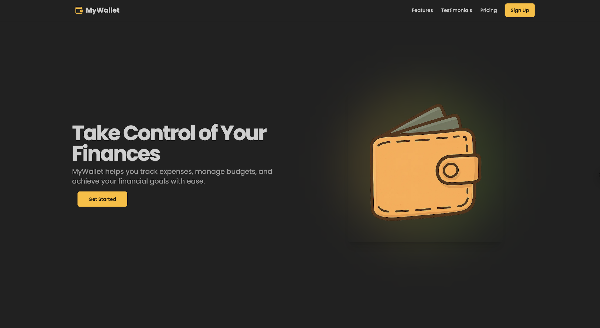
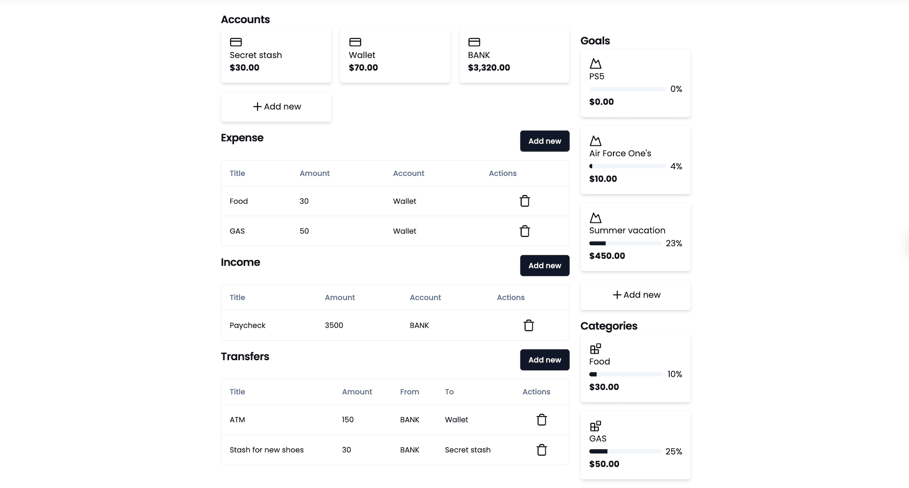
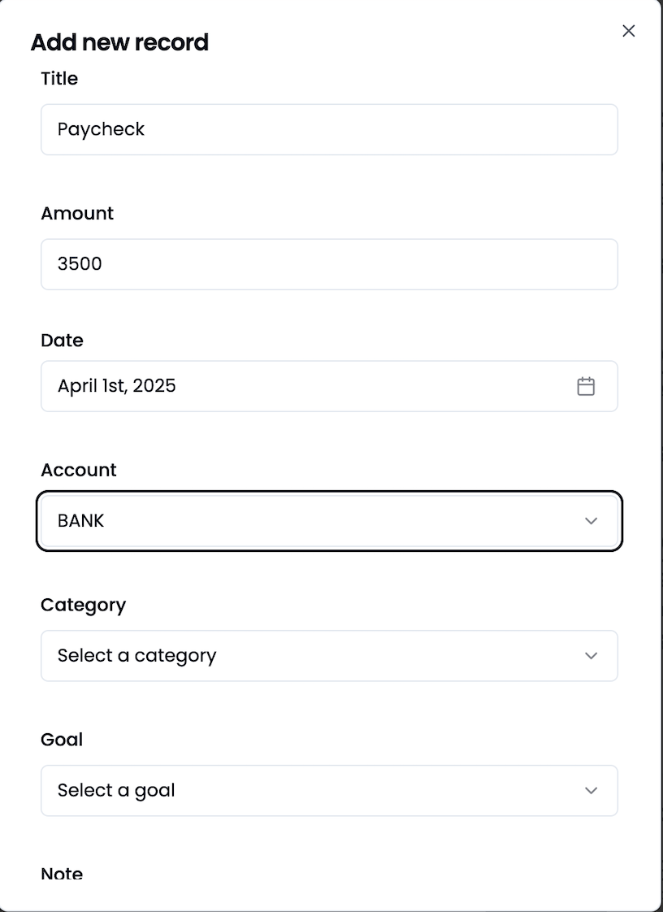
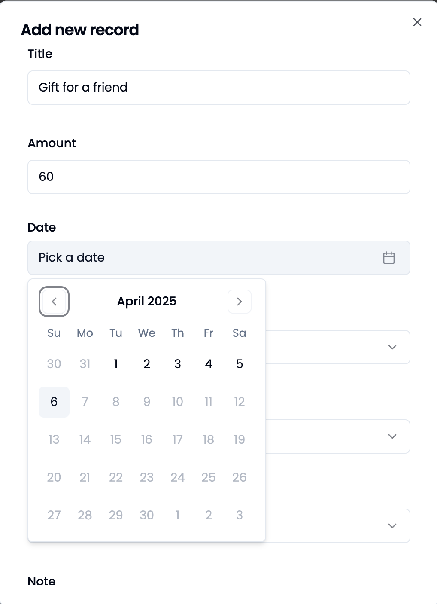
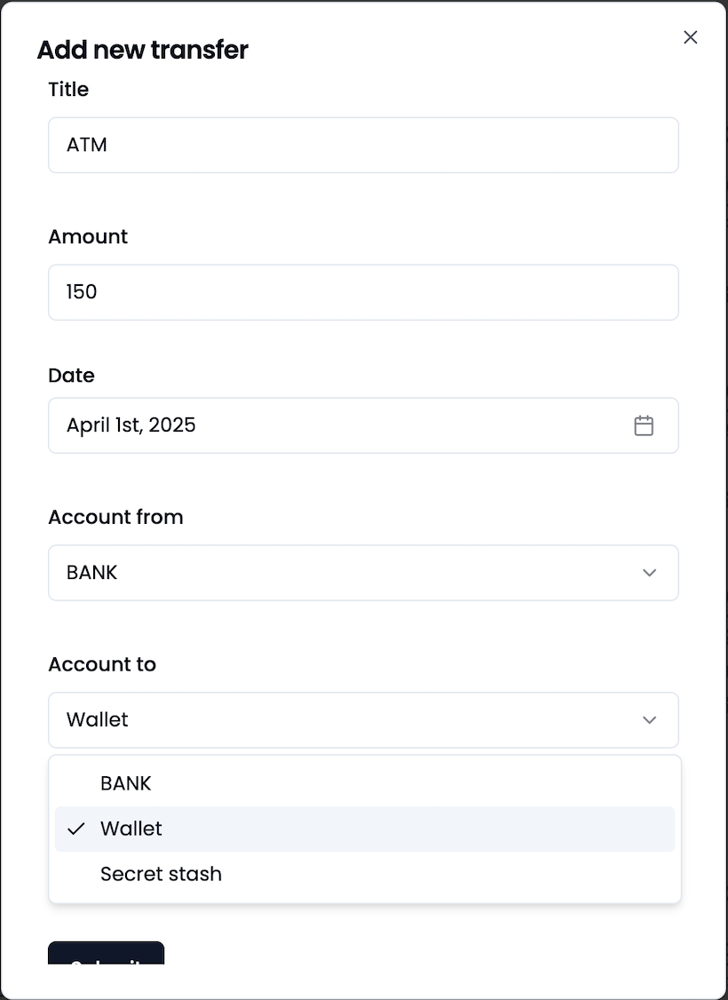

# 💰 MyWallet

**MyWallet** is a personal finance tracking application built with **NestJS**, **Prisma**, **MongoDB**, and **Auth.js**. It helps you take control of your finances by allowing you to track incomes, expenses, transfers between accounts, and set savings goals — all from a clean and intuitive dashboard.

---

## 📸 Screenshots

### 🏠 Landing Page



### 📊 Dashboard



### ➕ Add Expense / Income / Transfer

<div align="center">
  
  
  
</div>

---

## 🔑 Features

-  ✅ **Track Incomes & Expenses** – Easily log your earnings and spending.
-  🔁 **Transfers Between Accounts** – For example, taking $20 from an ATM and putting it into your Wallet.
-  🏦 **Accounts** – Bank, Wallet, Secret Stash, or any custom account.
-  🗂️ **Categories** – Organize transactions by Food, Gas, Rent, etc.
-  🎯 **Goals** – Save for specific goals like a new pair of shoes or a PlayStation 5.
-  📊 **Dashboard** – Get a quick overview of your current financial status.
-  🔐 **Authentication** – Sign in securely with Google using Auth.js.

---

## 🚀 Getting Started

### 1. Clone the Repository

```bash
git clone https://github.com/ahmedpasic19/MyWallet.git
cd mywallet
```

### 2. Install Dependencies

```bash
pnpm install
```

### 3. Configure Environment Variables

Create a `.env` file in the root directory and copy the contents of `.env.example` into it:

```env
DATABASE_URL=
NEXTAUTH_SECRET=
NEXTAUTH_URL=
GOOGLE_CLIENT_ID=
GOOGLE_CLIENT_SECRET=
JWT_SECRET=
NODE_ENV=
RESEND_API_KEY=
```

> 💡 Fill in the appropriate values for your setup (e.g., database URL, Google OAuth credentials, etc.)

### 4. Generate Prisma Client & Sync Database

```bash
pnpm prisma generate
pnpm prisma db push
```

### 5. Start the Application

```bash
pnpm dev
```

Visit `http://localhost:3000` to use the app.

---

## ⚙️ Tech Stack

| Technology | Purpose                            |
| ---------- | ---------------------------------- |
| Next.js    | Fullstack framework                |
| Prisma     | Database ORM                       |
| MongoDB    | NoSQL database                     |
| Auth.js    | Authentication via Google          |
| Resend     | Email notifications & varification |

---

## 🧪 Environment Variables

Make sure to set the following in your `.env` file:

```env
DATABASE_URL=           # MongoDB connection string
NEXTAUTH_SECRET=        # Auth.js session encryption
NEXTAUTH_URL=           # e.g., http://localhost:3000
GOOGLE_CLIENT_ID=       # Google OAuth client ID
GOOGLE_CLIENT_SECRET=   # Google OAuth secret
JWT_SECRET=             # JWT token encryption secret
NODE_ENV=               # development or production
RESEND_API_KEY=         # Resend email API key (optional)
```

---

## 🙋‍♂️ Author

Made with ❤️ by [ahmedpasic19](https://github.com/ahmedpasic19)

---

## 📄 License

This project is open-source and available under the [MIT License](LICENSE).
Feel free to use, modify, and distribute it as you wish.
